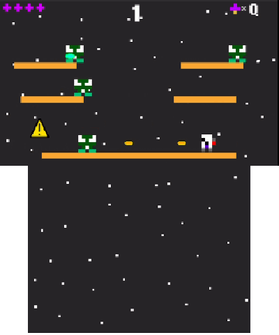
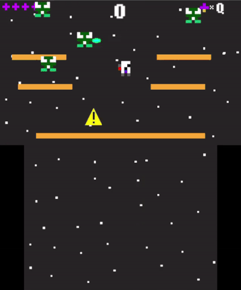

<!-- PROJECT LOGO -->
<h1 align="center">
  <br>
  <a href="https://github.com/BotRandomness/Mars3DS"></a>
  <br>
  <b>Mars3DS</b>
  <br>
  <sub><sup><b>Mars3DS, a retro style shooter 3DS homebrew, written in C++.</b></sup></sub>
  <br>

</h1>

<a href="https://github.com/BotRandomness/Mars3DS">
    
</a>

<p align="center">
<strong><em>A little history</em></strong>: <strong>Mars</strong> was actally a game I made before to be cross platform between PC and mobile devices from a single code base. However, even though I fully completed the game, I never relased it publicly. Hence why the project is called <strong>"Mars3DS"</strong> and not just <em>"Mars"</em>. Fast forward to now (when this readme was made), I was thinking about working on a C++ project. I have done a bit of C++, but did no projects on it. After coming off from making homebrew for the NDS using C, I thought well it make sense now to make a <strong>3DS homebrew using C++!</strong> Just like that, the idea of remaking Mars for 3DS came to be. Even when I made Mars originally, I always thought it would cool if this was some sort of homebrew for a Nintendo platfrom (maybe just the retro aesthetics was hitting me), but at the time I didn't have any C/C++ experience at all. But now that orignal idea is a reailty! The idea behind Mars is supposed to be a <strong>"lost retro game"</strong> hence why the game has a mininal feel <em>(if that made sense)</em>. <strong>Hope you enjoy! :) </strong>   

</p>

</div>

<!-- ABOUT THE PROJECT -->

## Getting Started

### Download
Should work on both real hardware (old 3DS/2DS, and new 3DS/2DS) and 3DS emulators like Citra. Note: for real hardware, you do need a homebrewed system.
#### 3dsx
1. Download the .3dsx ROM file [here](https://github.com/BotRandomness/Mars3DS/releases) or from the releases.
2. You can now run 3dsx file via the Homebrew Launcher.

#### cia
1. Download the .cia ROM file [here](https://github.com/BotRandomness/Mars3DS/releases) or from the releases.
2. You can install the .cia file via tools like FBI.

### Controls
- (+) or CirclePad to move
- (A) to shoot
- (B) to jump
#### Note
- Collect the mushrooms!

## Screenshots
<table>
    <tr>
        <th>3DS</th>
        <th>3DS</th>
    </tr>
    <tr>
        <td><a href="https://github.com/BotRandomness/Mars3DS"></a></td>
        <td><a href="https://github.com/BotRandomness/Mars3DS"></a></td>
    </tr>
  <tr>
        <td><a href="https://github.com/BotRandomness/Mars3DS"></a></td>
        <td><a href="https://github.com/BotRandomness/Mars3DS"></a></td>
    </tr>
</table>

<table>
    <tr>
        <th>Game play</th>
    </tr>
  <tr>
        <td><a href="https://github.com/BotRandomness/Mars3DS"></a></td>
    </tr>
</table>

## Compile

Want to tinker around, modify, make your own, learn a bit about 3DS homebrew, or contribute? Here's how you can get started with the code and compile.

To make 3DS homwbrew, a open-source toolchain known as DevKitPro is used. DevKitPro comes with many compilers and libraries to start homebrew development on many consoles! The specific library were using is citro2d which should come with DevKitPro.

1. Download DevKitPro: https://devkitpro.org/, please do look over their getting started.
2. After DevKitPro is set up, download this repository through zip, or git, then open up your terminal, pointing inside the project directory.
3. Run `make` in the terminal, and `Mars3D.3dsx` will be made!

#### Installable .cia file
<strong>This is only for if your interested if you want to produces a .cia file which is a 3DS installable file.</strong> These instruction are not only revelent for this project, but you can apply this to own 3DS homebrew project if you are interested, <strong>hence why I included this part, just to share this information if you are curious.</strong> With this in mind, these <strong>steps are written to be very general.</strong>  

1. Do the previous steps mentioned before from steps 1 to 3.
2. Along with the `.3dsx` file, you may notice a `.elf` is also made. This is like a raw binary, we need this produce a `.cia` file.
3. With the `Mars3D.elf` and the files in the `meta` directory you make the Mars3D.cia with tools makerom and bannertool. You can get makerom and bannertool here:
   - [makerom](https://github.com/3DSGuy/Project_CTR/releases/tag/makerom-v0.18.4) (Credits to 3DSGuy)
   - [bannertool](https://github.com/Steveice10/bannertool/releases) (Credits to Steveice10)
4. Since these are command line tool (CLI), you can add them to your local PATH, or have the excutable with the .elf files, and all the files in the meta directory, the romfs directory, all in one directory.
5. Side note : As you may know, the cool part of having your homebrew made into a .cia file is that it's installable to the 3DS, so it can be on the 3DS menu with a custom banner. To learn how to make a custom 3D banner, here is a great guide on GBATemp made by MovieAutomotive [here](https://gbatemp.net/threads/creating-3d-banners-from-3d-models-for-cias.433783/).

  - First to build the banner:
    ```sh
    bannertool makebanner -ci "banner.cgfx" -a "banneraudio.wav" -o "banner.bnr"
    ```
    Note: If don't want a 3D banner but just 2D banner, a `.png` banner, replace `-ci` with `-i`. Also the banner audio should a `.wav` format that is 3 seconds or less. 

  - Then to build the icon and the meta data:
    ```sh
    bannertool makesmdh -i "icon.png" -s "Name" -l "Description" -p "Author" -o "icon.icn"
    ```

  - Finally to build the .cia file:
    ```sh
    makerom -f cia -target t -exefslogo -o "rom.cia" -elf "rom.elf" -rsf "build.rsf" -banner "banner.bnr" -icon "icon.icn"
    ```
    If you're wondering what the `build.rsf` is, it's essentailly meta data for your 3DS game/application. This includes Unique ID, path to romfs, permissions, etc.

### Program Architechture
Here's a little on the program layout!

Looking over the code, the program is quite simple, don't worry! This portation was written to be simple, so no matter of your skill level, anybody should get the idea of the program works, it's sort of the reason why I write these parts! :)

C++ is a object oriented language. With this is mind, this game is built off of objects. The player, `Astro`, is a object, the bullets for both the player and enemy are objects, the "Enemy" is a object, etc. Each object like the player have values that is only relevant to itself. For example: the `x` and `y` position, the height, `h`, the width `w`, `speedX`, `speedY`, etc. Each object also have methods that handle behaviours of the object. For example, going back to the player, it has a method for `void Astro::movement()` to handle movement controls, and `void Astro::collision(std::vector<Platform>& platList)` to handle collision on platforms, which themselves are objects.

Then each objects will have these 2 methods look like this:
```cpp
//Example tooken from the Astro (player) object
void Astro::update(std::vector<Platform>& platList) 
{
	if (health >= 1) 
	{
		collision(platList);
		movement();
		shoot();
  }

	//code cont...
}

void Astro::render() 
{
	if (health >= 1) 
	{
		C2D_DrawSprite(&astro);
	}
	
	C2D_DrawSprite(&healthBar);

	for (std::size_t i = 0; i < bullList.size(); i++) 
	{
		bullList[i]->render();
	}
}
```

After creating methods relating to behaviours, I call these methods in a update method or a render method. The update handles anything that relates to changes of values, and render handles all methods realting to draw the sprite on screen. You may be wondering why I did this? Well have all these object but nothing to put them together. This bring on the segway to scenes!

In the `main.cpp` file, the main game loop is divided into 2 parts. A `update` part and the `render` part. Sounds familiar right? Using citro2d, Any functions that realates to drawing sprites on screen have to be called in between `C3D_FrameBegin(C3D_FRAME_SYNCDRAW);` and `C3D_FrameEnd(0);` This is why I divided the object's methods were funnel into one of the two update and render parts. This is not only better for organization, but makes it easier to track a object within a scene. Now the scene itself is not object. I made the choice to not make the scenes in to object as this a very simple game, and didn't want to complicated more. To understand this better, here's a example of how the scenes are handle:

```cpp
//Main game loop
while(aptMainLoop())
{
  //Update
  hidScanInput();
  hidTouchRead(&touch);

  if (hidKeysDown() & KEY_START) break; //Back to Homebrew Menu

  if (scene == 0)
  {
     //code...
  }
  ...

  //Render
  C3D_FrameBegin(C3D_FRAME_SYNCDRAW);
  C2D_SceneBegin(top); //For drawing on the top screen
  C2D_TargetClear(top, C2D_Color32(0.0f, 0.0f, 0.0f, 0.0f)); //Background color

  if (scene == 0)
  {
     //code...
  }
  ...

  C2D_SceneBegin(bot); //For drawing on the bottom screen
  C2D_TargetClear(bot, C2D_Color32(219.0f, 95.0f, 27.0f, 0.0f));

  if (scene == 0)
  {
     //code...
  }
  ...

  C3D_FrameEnd(0);
}
...
```
As seen in the basic structure for the main game loop, the transition between the scenes are handled by a `scene` varible, with the if statement handling that specfic methods and function calls needed for that scene.

Outside the main function there a few function. These few functions relate to the scene, handling actions such as `void spawnEnemy(std::vector<Enemy*>& paraList, RNG& gen, int minX, int maxX, int minY, int maxY, std::chrono::steady_clock::time_point& startTime)` If I had each scene as a objects, these functions would basically be methods of the scene.

Do note I used very simple memory management. In C++ there are smart pointers, however since the program is simple, I chose the route of using the `new` and `delete`. Memeory management is used for spawning and delating bullets of both player and enemies, as well the ememies themselves.

So far I haven't really talked on how citro2d works, and that's because citro2d itself is really simple in way where it has function to make sprites, and draw them to screen, and that's pretty much it. For those are curious, citro2d it self is built on citro3d and libctru, which both are also included with devkitpro. If you ever used frameworks like raylib, or NightFox's Lib with libnds for NDS homebrew, it's pretty simular to those. I recommend looking at the citro2d documentation, and for example, the player object code to understand the basics of citro2d. Here is citro2d documentation: https://citro2d.devkitpro.org/ Here is libctru documentation: https://libctru.devkitpro.org/  

If you are interested in the 3DS and or want to know about hardware in enhance your 3DS homebrew skills, this is a good read:
- Rodrigo Copetti's Nintendo 3DS Architechture Analysis: https://www.copetti.org/writings/consoles/nintendo-3ds/

## Upcoming Features

- [ ] CRT Fillter
  - Something I had in the orignal game, but couldn't implement in this 3DS version 
- [ ] Saving. Save high score.
- [ ] Add sound effects
      - Not too sure how to this, but any help would be great!
- Post any feature request in the Issues tab!

## Known issues

- [ ] <strong>Text rendering is not efficient!</strong>
  - After a while the score text and the anti-gravity mushroom counter disappear! I'm not really too sure on how text rendering works in citro2d, so any help on this would be great! :)
- [ ] Enemies can sometimes get stuck on the edge of platforms
- [ ] Values for spawing can be tweaked
- [ ] Overall code can be refactor (especially in `main.cpp`)
- If you find any other issues/bugs, post about it on the issues tab

## Contributing

This project is open-source under the MIT License, meaning your free to do what ever you want with it. This project is freely available for anyone to contribute, 3DS lover, homebrew developers, or someone who is new to it all.

If you plan on contributing, a good place to start is to look at upcoming wanted features, and known issues. If you find a new bug, or have feature ideas of your own, posted first to the Issues tab before hand. You can even fork it and make it your own! </br>

To get started on contributing:

1. Fork or Clone the Project
2. Once you have your own repository (it can be a public repository) to work in, you can get started on what you want to do!
3. Make sure you git Add and git Commit your Changes to your repository
4. Then git push to your repository
5. Open a Pull Request in this repositroy, where your changes will be look at to be approved
6. Once it's approved, it will be in a development branch, soon to be merge to the main branch

<!-- LICENSE -->

## License

Distributed under the MIT License. See `LICENSE.txt` for more information.
